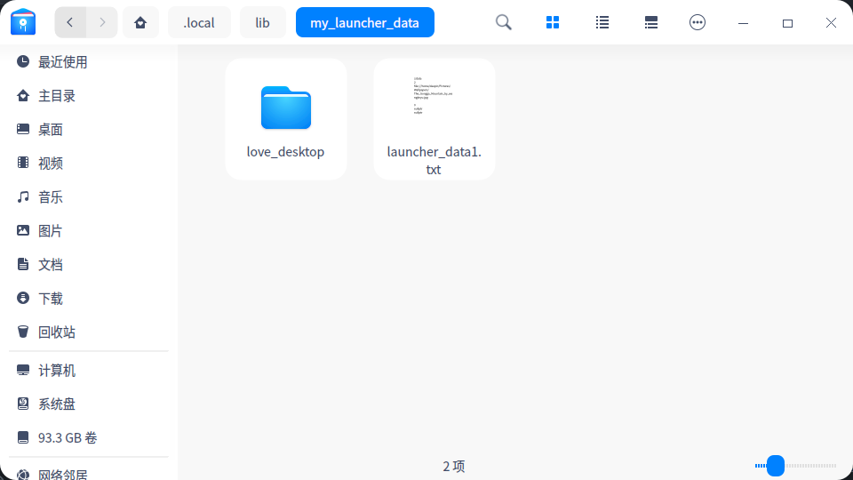
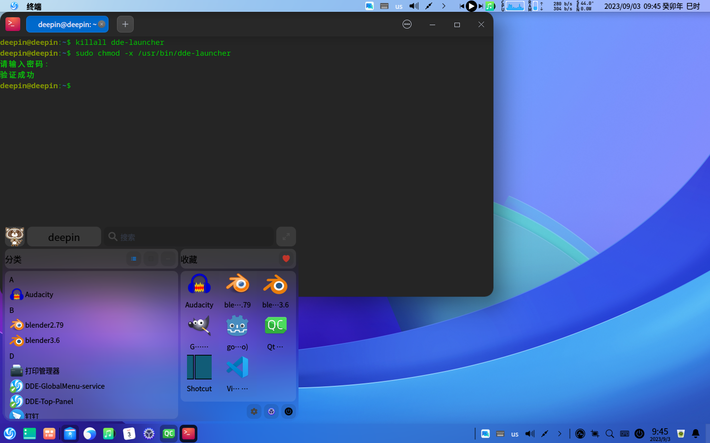
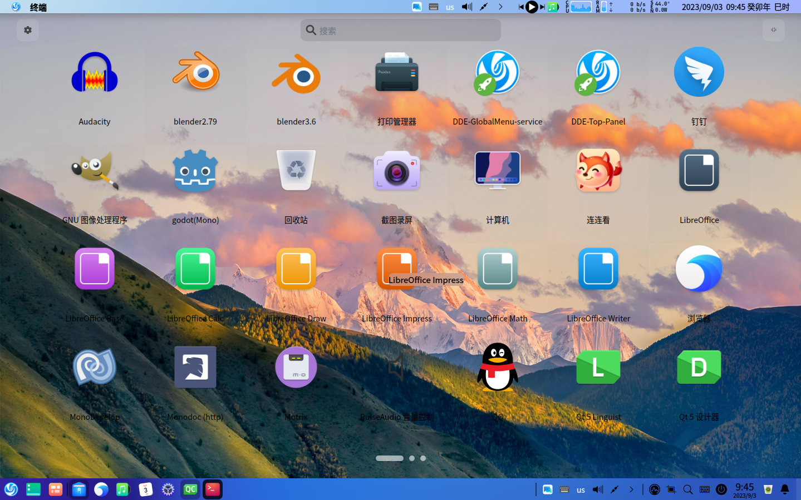
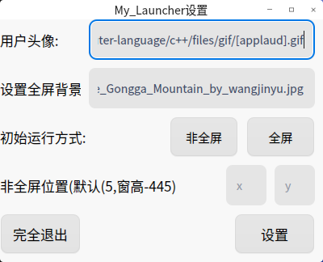

# My_Launcher
My_Launcher;启动器launcher qt制

# 开发环境

deepin20.9

qt 5.15.8
### QMake Pro:QT += core gui widgets x11extras KWindowSystem
### 使用GPL3.0
## 在V20中粗仿制V23的launcher
## 不支持

1.不支持查找linglong应用

2.可拖动到任务栏,无法发送到任务栏

3.不支持launcher中的右键卸载

4.不支持使用代理

5.不支持使用鼠标拉动launcher进行换页,使用鼠标滚轮换页

6.不支持除Esc Launcher按键以外的键盘操作

## 存档
存档于"~/.local/lib/my_launcher_data"

## 主要QWidget

1.Launcher_Widget

2.Launcher_FullScreen

3.Setting_Widget

## 演示
1.Launcher_Widget

2.Launcher_FullScreen

3.Setting_Widget

### 10.14更新
#### 1.增加QDBus服务

#### 2.增加搜索范围&&linglong应用的desktop
#### 搜索包含至desktop真实文件名

#### 3.关于libreoffice启动失败问题
#### 失败原因：在QtCreater中启动

#### 4.增加desktop中Terminal为true的以终端运行功能
#### 5.至于发送到任务栏的QDBus
#### 翻过dde-dock，但我找不到
#### 6.修复MyShowLoveLabel当OnlyDragListView的数量为9的倍数时，底部页码显示不正常的问题

### 编译后的可执行文件置于Releases中
源码地址: 

[https://github.com/3084793958/My_Launcher.git](https://github.com/3084793958/My_Launcher.git)

[https://githubfast.com/3084793958/My_Launcher.git](https://githubfast.com/3084793958/My_Launcher.git)
